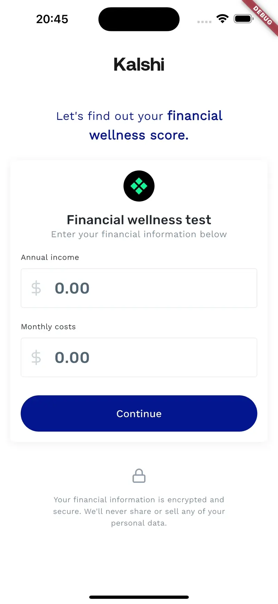

# Financial Wellness

Financial Wellness is an app that helps people to keep track of their financial situation.

In order to do that, users registers information regarding their financial situation. Two key pieces of information are his annual gross income and average monthly costs.

Based on that information, the system calculates a score to represent how healthy his financial life is - Healthy, Medium or Low.

Demo:  
  

## Setup

Install Flutter version 3.29.0.

Run the app as any regular Flutter app.

## Project structure

This project follows the official [Flutter Architecture Guide](https://docs.flutter.dev/app-architecture/guide).
As it's a small project, only three layers were necessary: `domain`, `data` and `presentation`. 

#### Domain layer

Holds the Entites and Use Cases. It's where all the important application rules and business rules are implemented.

Entities are the backbone of our application. The UI will always use them, so keep it simple.

Usecases are responsible to implement business rules, consuming and returning entities. Also, are responsible to interact with the data layer.

#### Data layer

Layer responsible for handle the access to remote or local data sources. This data source can be anything, from a local file (👋 `AppConstants`), to a remote API or local database.

I this project the data layer was added just to deliver the current tax rate. If some day this tax rate come from a REST API, we are safe.

#### Presentation layer

This layer is responsible for centralize all the user interface related content, such as theme, colors, typography, icons, custom widgets and the views.

It uses the MVVM pattern, using `Cubit` as its state management system.

#### Communicating between layers

The external layers can see and access the internal layers, but the internal layers should never know the external layers exists.

Following this idea, our business rules and most important classes will never be affected by any external factors.

To cross the boundaries we should use the dependency inversion principle (DIP), depending always on abstractions.

Here is a practical example where a UI controller depends on a usecase, which in turn depends on a repository to execute some feature. They always depends on abstractions. Take a look:

```dart
// src/presentation/views/some_feature/my_controller.dart
class MyController {
    final IMyUsecase _myUsecase;
    MyController(this._myUsecase);
}

// src/domain/usecases/my_usecase.dart
abstract class IMyUsecase {
    void doSomething();
}

class MyUsecase extends IMyUsecase {
    final IMyRepository _myRepository;
    MyUsecase(this._myRepository);

    @override
    void doSomething() {
        _myRepository.doWhatever();
    }
}

// src/domain/interfaces/repositories/my_repository.dart
// The repository interface is a prerequisite of a usecase, so it is kept inside domain layer
abstract class IMyRepository {
    void doWhatever();
}

// src/data/repositories/my_repository.dart
// The implementation goes to the data layer
class MyRepository extends IMyRepository {
    void doWhatever() {
        print('hi');
    }
}

// src/boostrap.dart
// The entrypoint or  "shell application" or "host". Is where all the things are put together and usually added to a dependency injection/service locator system 
void bootstrap() {
    IMyRepository myRepository = MyRepository();
    IMyUsecase myUsecase = MyUsecase(myRepository);
    MyController(myUsecase);
}
```


## Design system

The app design system follows the Figma prototype definitions, using its colors, text styles and assets.


### Color Palette

The color palette was designed to implement a custom interface called `IAppColorPalette`. In the long term it can be useful for a white-label implementation.

The colors was named to make its usage easier. An improvement can be made by talking to UX team to follow the same name convention in the prototype.

The color palette can be accessed through a `BuildContext` extension:

```dart
Container(
    color: context.colors.primary,
)
```

### Typography

Two font families were used: Work Sans and Rubik. Both are downloaded through `GoogleFonts` package.

The text styles were named according to the Figma description, but, as the color palette, it also can be improved in order to make all the used styles more clear and organized in one stylesheet.

The text styles can be accessed through a `BuildContext` extension:

```dart
Text(
    'Example',
    fontStyle: context.text.xs.headingSmall,
)
```

### Assets

All app assets are available through `AppAssets` and `AppIcons`.

## I18n

The package [Slang](https://pub.dev/packages/slang) was used to handle the internationalization. It's a complete solution that delivers some cool features like linking text entries to enums or building rich text to merge different styles in the same text.

All the strings are stored in the `assets/i18n` folder. The `build_runner` should be executed whenever the content in this folder changes.